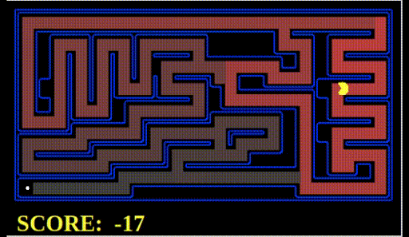
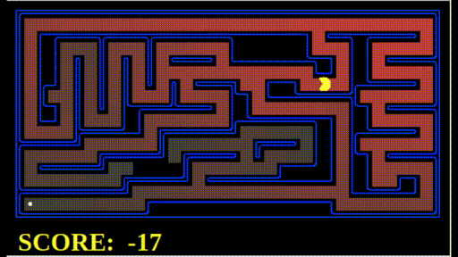
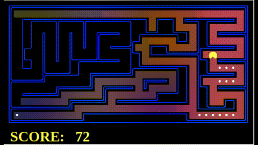
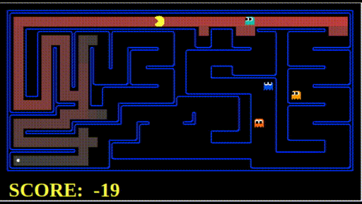
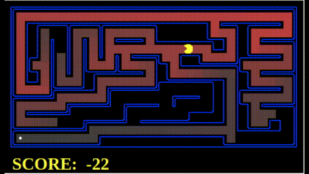

# Алгоритмы поиска на графах на примере игры Pacman
Источник: https://inst.eecs.berkeley.edu/~cs188/fa18/project1.html

В данном проекте агент Pacman с помощью алгноритмов поиска на графах проходит лабиринт и эффективно собирает по пути еду.

### Структура файлов

Основные файлы:
* `search.py`   содержит все алгоритмы поиска;
* `searchAgents.py` - содержит агентов, основанных на поиске;
* `pacman.py` - основной файл, запускающий игру Pacman.

### Зависимости
* python3
* tkinter

### Алгоритм поиска в глубину (DFS)  

**Весь код запускается из директории scripts!**

```bash
python3 pacman.py -l mediumMaze -p SearchAgent
```  
  


**Примечание.** Опция *-l* задает тип лабиринта:  
* tinyMaze - маленький;
* mediumMaze - средний;
* bigMaze - большой.  
Полный список опций можно увидеть, набрав в терминале:  
```bash
python3 pacman.py -h
```

### Поиск в Ширину (BFS)  

```bash
python3 pacman.py -l mediumMaze -p SearchAgent -a fn=bfs
```  
  

### Алгоритм Uninformed cost search (UCS)  

Простой лабиринт:
```bash
python3 pacman.py -l mediumMaze -p SearchAgent -a fn=ucs
```  
  
Лабиринт с едой:
```bash
python3 pacman.py -l mediumDottedMaze -p StayEastSearchAgent
```  
  
Лабиринт с призраками:
```bash
python3 pacman.py -l mediumScaryMaze -p StayWestSearchAgent
```  
  

### Алгоритм A*  
Запуск реализации алгоритма A*  для решения задачи поиска пути, используя эвристику Манхеттоновское расстояние, осуществляется командой:
```bash
python3 pacman.py -l mediumMaze -z .5 -p SearchAgent -a fn=astar,heuristic=manhattanHeuristic
```  
  

### Поиграть самому  
Поиграть в Pacman можно, набрав в терминале:

```bash
python3 pacman.py
```
Eсли Pacman застрял, вы можете выйти нажав CTRL-C в вашем терминале.